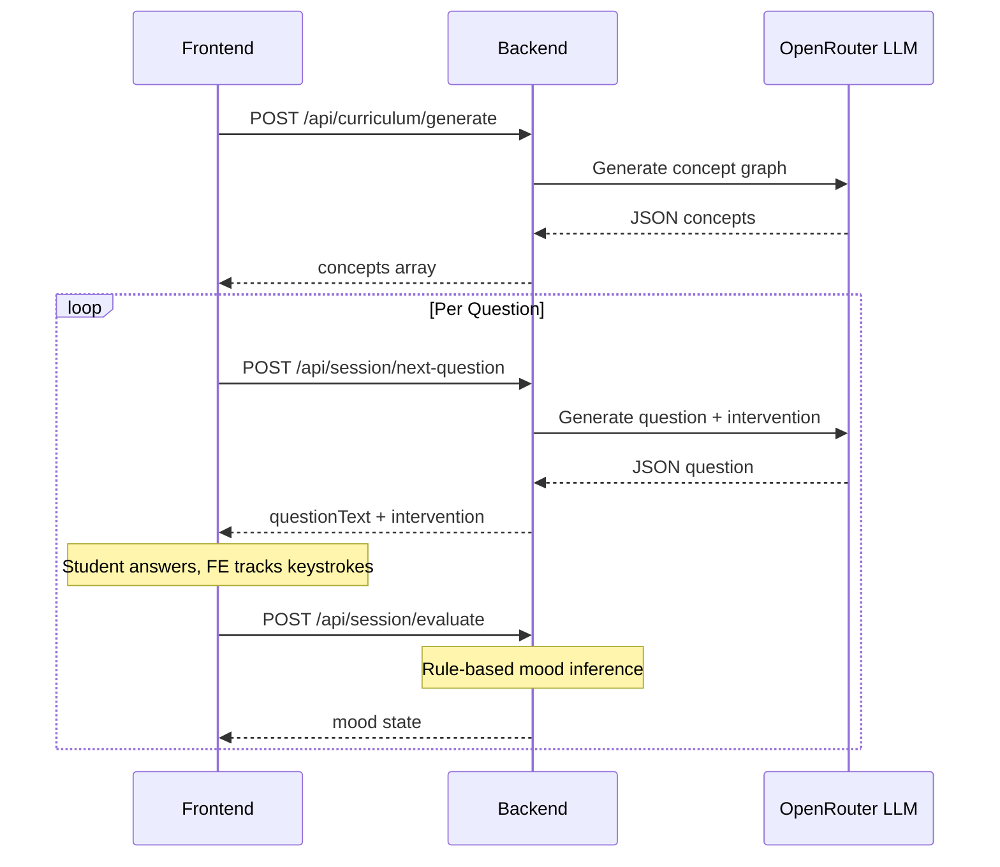
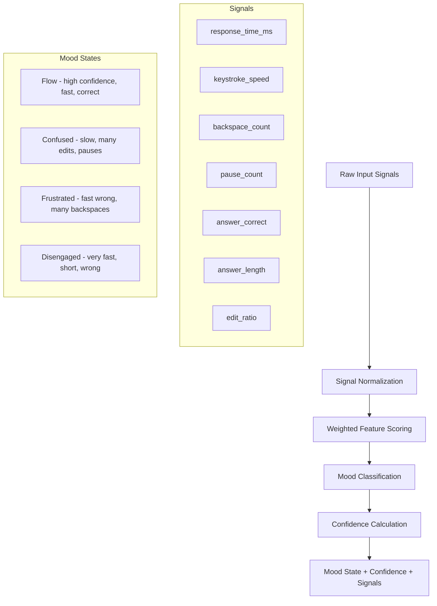
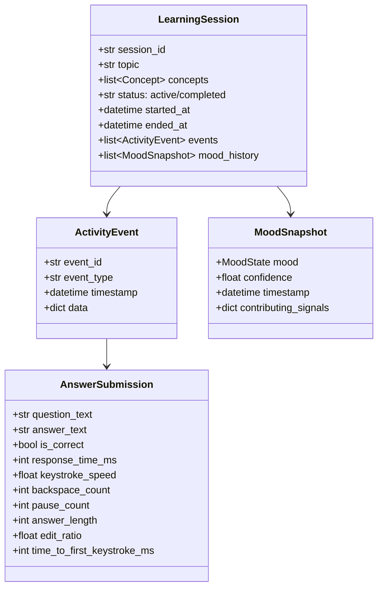

# Mood-Aware Learning Coach — Backend Architecture Plan

## Current State Analysis

### Existing Architecture
The project is a **monorepo** with two main directories:
- **`backend/`** — Python FastAPI server (port 8000)
- **`frontend/`** — Next.js 14 app (port 3000, developed by another team)

### Existing Backend Components

| File | Purpose |
|------|---------|
| [`backend/main.py`](backend/main.py) | Single-file FastAPI app with all routes, models, and logic |
| [`backend/ai_service.py`](backend/ai_service.py) | OpenRouter LLM integration for curriculum and question generation |
| [`backend/requirements.txt`](backend/requirements.txt) | Dependencies: fastapi, uvicorn, httpx, python-dotenv, python-multipart |

### Existing API Endpoints

| Method | Path | Status | Purpose |
|--------|------|--------|---------|
| GET | `/health` | ✅ Working | Health check |
| POST | `/api/curriculum/generate` | ✅ Working | Generate concept dependency graph via LLM |
| POST | `/api/content/extract` | ⚠️ Mock | Extract concepts from notes (placeholder) |
| POST | `/api/session/evaluate` | ✅ Working | Infer mood from typing/response metrics |
| POST | `/api/session/next-question` | ✅ Working | Generate next question adapted to mood |

### Current Data Flow



### Key Observations

1. **No session persistence** — Each request is stateless; no session tracking across questions
2. **No data storage** — Typing patterns, mood history, and performance are not stored
3. **Monolithic structure** — All code in a single `main.py` file
4. **Simple mood rules** — Basic threshold-based mood detection without confidence scoring
5. **No input validation beyond Pydantic** — No custom error handling or middleware
6. **No logging** — No structured logging for debugging or analytics
7. **Frontend tracks keystrokes** — Backspace count, pause count, response time, and keystroke speed are already captured by the frontend and sent to the backend

---

## Proposed Architecture

### Target Directory Structure

```
backend/
├── app/
│   ├── __init__.py
│   ├── main.py                    # FastAPI app factory, middleware, startup
│   ├── config.py                  # Settings via pydantic-settings
│   ├── dependencies.py            # Shared FastAPI dependencies
│   │
│   ├── models/                    # Pydantic request/response schemas
│   │   ├── __init__.py
│   │   ├── curriculum.py
│   │   ├── session.py
│   │   ├── mood.py
│   │   └── analytics.py
│   │
│   ├── routers/                   # API route handlers grouped by domain
│   │   ├── __init__.py
│   │   ├── health.py
│   │   ├── curriculum.py
│   │   ├── content.py
│   │   ├── session.py
│   │   └── analytics.py
│   │
│   ├── services/                  # Business logic layer
│   │   ├── __init__.py
│   │   ├── ai_service.py          # LLM integration (refactored)
│   │   ├── mood_engine.py         # Enhanced mood inference
│   │   ├── session_manager.py     # Session lifecycle and state
│   │   └── analytics_service.py   # Learning data aggregation
│   │
│   ├── store/                     # Data persistence layer
│   │   ├── __init__.py
│   │   ├── memory_store.py        # In-memory session store
│   │   └── models.py              # Internal data models
│   │
│   └── middleware/                 # Custom middleware
│       ├── __init__.py
│       ├── error_handler.py
│       └── logging.py
│
├── tests/
│   ├── __init__.py
│   ├── test_mood_engine.py
│   ├── test_session_manager.py
│   └── test_api_endpoints.py
│
├── requirements.txt
├── .env.example
└── README.md
```

### New/Enhanced API Endpoints

#### Session Management
| Method | Path | Purpose |
|--------|------|---------|
| POST | `/api/session/start` | Create a new learning session, return session_id |
| GET | `/api/session/{session_id}` | Get current session state |
| POST | `/api/session/{session_id}/activity` | Ingest raw learning activity data |
| POST | `/api/session/{session_id}/evaluate` | Evaluate answer + infer mood within session context |
| POST | `/api/session/{session_id}/next-question` | Get next question with full session history context |
| POST | `/api/session/{session_id}/end` | End session, return summary analytics |

#### Analytics
| Method | Path | Purpose |
|--------|------|---------|
| GET | `/api/session/{session_id}/analytics` | Get mood timeline, performance stats for a session |
| GET | `/api/session/{session_id}/mood-history` | Get mood state transitions over time |

#### Backward Compatibility
The existing stateless endpoints will remain functional for the frontend team during transition:
- `POST /api/session/evaluate` — still works without session_id
- `POST /api/session/next-question` — still works without session_id

### Enhanced Mood Inference Engine



The enhanced engine will:
1. Accept additional signals: `answer_length`, `edit_ratio` (chars deleted / chars typed), `time_to_first_keystroke`
2. Normalize signals relative to the student's own baseline within the session
3. Compute weighted scores for each mood state
4. Return mood + confidence level (0.0–1.0) + contributing signals
5. Track mood transitions over time within a session

### Session Activity Data Model



### Key Design Decisions

1. **In-memory store first** — Use a dictionary-based store for sessions; designed with an abstract interface so a database can be swapped in later
2. **Backward-compatible API** — Existing endpoints remain unchanged; new session-aware endpoints are additive
3. **Modular services** — Each service is independently testable and replaceable
4. **No frontend changes required** — The frontend team can adopt session-based endpoints at their own pace
5. **Prepared for future ML** — The activity data schema captures enough signal for future emotion detection models
6. **Structured logging** — All requests logged with correlation IDs for debugging

---

## Implementation Priority Order

1. **Refactor into modular package** — Move from single-file to proper package structure
2. **Session management** — Create/track/end sessions with in-memory store
3. **Enhanced data ingestion** — Accept richer learning activity data
4. **Improved mood engine** — Weighted scoring, confidence, baseline normalization
5. **Analytics endpoints** — Session summaries, mood timelines
6. **API documentation** — OpenAPI enhancements, response examples
7. **Error handling & logging** — Middleware, structured logs
8. **Tests** — Unit tests for mood engine and session manager

---

## Dependencies to Add

```
# requirements.txt additions
pydantic-settings    # Typed configuration management
structlog            # Structured logging
uuid                 # Session ID generation (stdlib)
pytest               # Testing
pytest-asyncio       # Async test support
httpx                # Already present, also used for test client
```

---

## Compatibility Notes

- The frontend currently calls `http://localhost:8000` directly
- All existing endpoint paths and request/response schemas MUST remain unchanged
- New endpoints are purely additive
- CORS configuration remains the same
- The `OPENROUTER_API_KEY` environment variable is still required for LLM features
